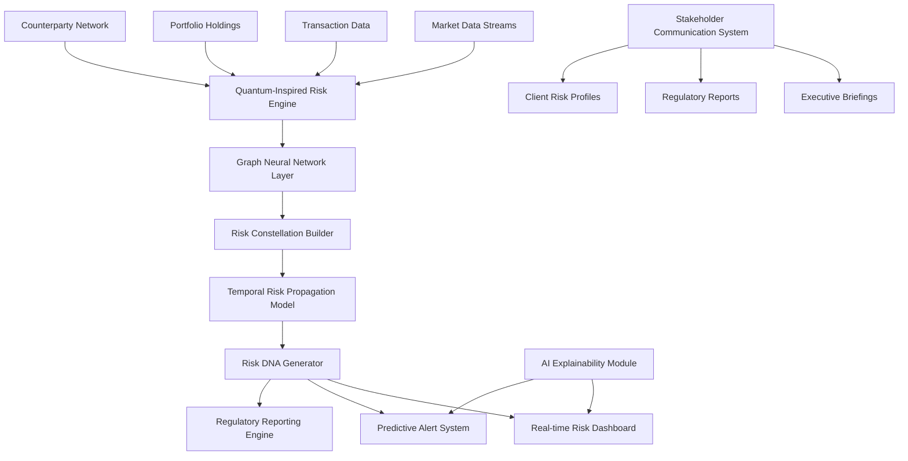

## Project 1: Quantum-Inspired AI Risk Constellation System

### Overview
A revolutionary multi-dimensional risk assessment platform that uses quantum-inspired algorithms and graph neural networks to model interconnected financial risks across portfolios, counterparties, and market conditions in real-time. Unlike traditional risk models that analyze risks in isolation, this system creates a "risk constellation" - a living, breathing network that shows how risks propagate, amplify, or cancel each other out across the entire enterprise.

### Innovation Factor
- **Never-before-seen approach**: Combines quantum annealing simulation with graph neural networks to solve the NP-hard problem of multi-dimensional risk correlation
- **Real-time risk DNA**: Creates unique "risk fingerprints" for every transaction, portfolio, and entity
- **Predictive risk cascades**: Identifies potential domino effects before they happen using temporal graph attention networks
- **Explainable quantum decisions**: Translates complex quantum-inspired computations into human-understandable risk narratives

### Architecture Diagram

### Task Breakdown

#### Task 1 (Technical - Data Science/ML): Quantum-Inspired Risk Engine & Graph Neural Networks
**Complexity: High**

Build the core AI engine that powers the risk constellation system:

- Implement quantum-inspired optimization algorithms (QAOA-style) for portfolio risk optimization
- Design and train custom Graph Attention Networks (GAT) for modeling risk propagation across counterparty networks
- Create temporal graph neural networks to predict risk cascade patterns
- Develop the "Risk DNA" algorithm that generates unique risk signatures for entities
- Build real-time inference pipeline capable of processing 100K+ risk calculations per second
- Implement federated learning framework for privacy-preserving risk model training across institutions

**Deliverables:**
- Quantum-inspired risk optimization engine (Python/PyTorch)
- Custom GAT models for risk propagation
- Risk DNA generation algorithm
- Real-time inference API
- Model training pipeline with MLOps integration

#### Task 2 (Technical - Backend/Infrastructure): Distributed Risk Processing Platform
**Complexity: High**

Build the scalable infrastructure that ingests, processes, and serves risk data:

- Design event-driven microservices architecture for real-time data ingestion from multiple sources
- Implement distributed graph database (Neo4j/TigerGraph) for storing risk constellation networks
- Build streaming data pipeline using Apache Kafka/Flink for real-time risk updates
- Create API gateway with GraphQL for flexible risk data queries
- Implement caching layer (Redis) for sub-millisecond risk lookups
- Design disaster recovery and data consistency mechanisms
- Build monitoring and observability stack (Prometheus/Grafana)

**Deliverables:**
- Microservices architecture (Go/Rust for performance-critical services)
- Graph database schema and optimization
- Real-time streaming pipeline
- GraphQL API layer
- Infrastructure-as-code (Terraform/Kubernetes)

#### Task 3 (Technical - Frontend/Visualization): Interactive Risk Constellation Interface
**Complexity: High**

Create an immersive, interactive visualization platform for exploring risk networks:

- Build 3D force-directed graph visualization of risk constellations using WebGL (Three.js/D3.js)
- Implement interactive risk exploration with zoom, filter, and time-travel capabilities
- Create real-time risk heatmaps and flow animations showing risk propagation
- Design AI-powered natural language query interface for risk questions
- Build customizable dashboard with drag-and-drop widgets
- Implement collaborative features for team risk analysis sessions
- Create mobile-responsive views for executive access

**Deliverables:**
- React/Next.js web application
- 3D risk visualization engine
- Natural language query interface
- Real-time dashboard with WebSocket updates
- Mobile-responsive design

#### Task 4 (Non-Technical - Strategy/Communication): Risk Narrative & Stakeholder Engagement
**Complexity: Medium-High**

Develop the strategic framework and communication materials for enterprise adoption:

- Create comprehensive risk taxonomy and glossary for the new system
- Design stakeholder communication strategy (executives, risk managers, regulators, clients)
- Develop training materials and certification program for risk analysts
- Write regulatory compliance documentation and audit trails
- Create executive briefing templates with AI-generated risk narratives
- Design change management plan for enterprise rollout
- Develop case studies and ROI models for different risk scenarios
- Create marketing materials demonstrating competitive advantage

**Deliverables:**
- Risk taxonomy documentation
- Stakeholder communication playbook
- Training curriculum and materials
- Regulatory compliance documentation
- Executive briefing templates
- Change management roadmap
- ROI analysis framework

### Expected Impact
- 60% reduction in risk assessment time
- 40% improvement in risk prediction accuracy
- Real-time identification of systemic risk patterns
- Regulatory compliance automation
- Competitive advantage through superior risk intelligence